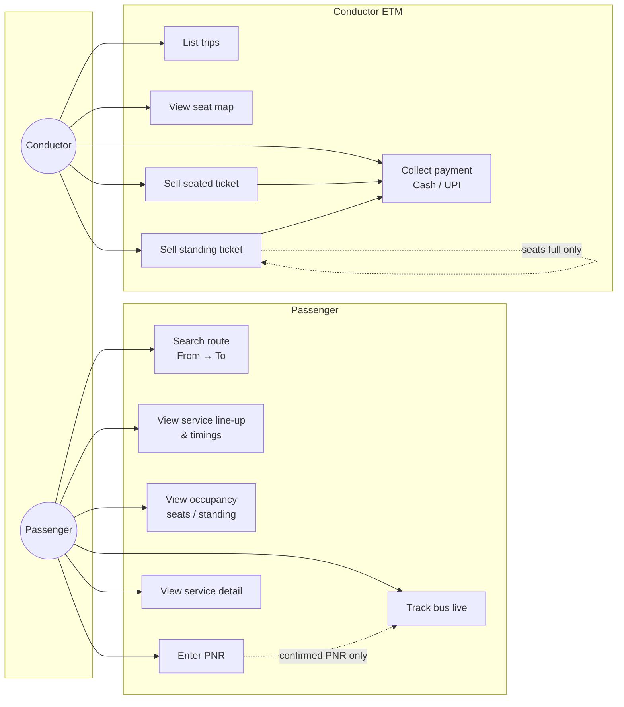
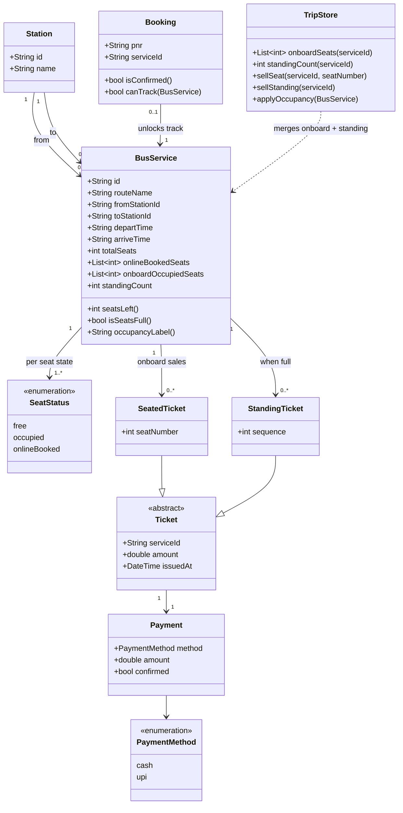
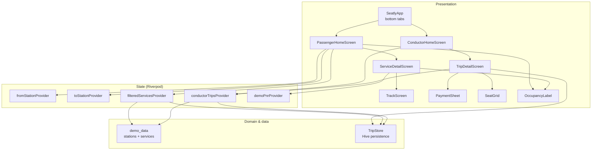
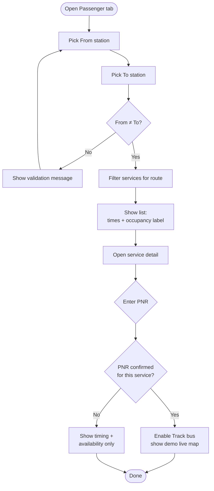
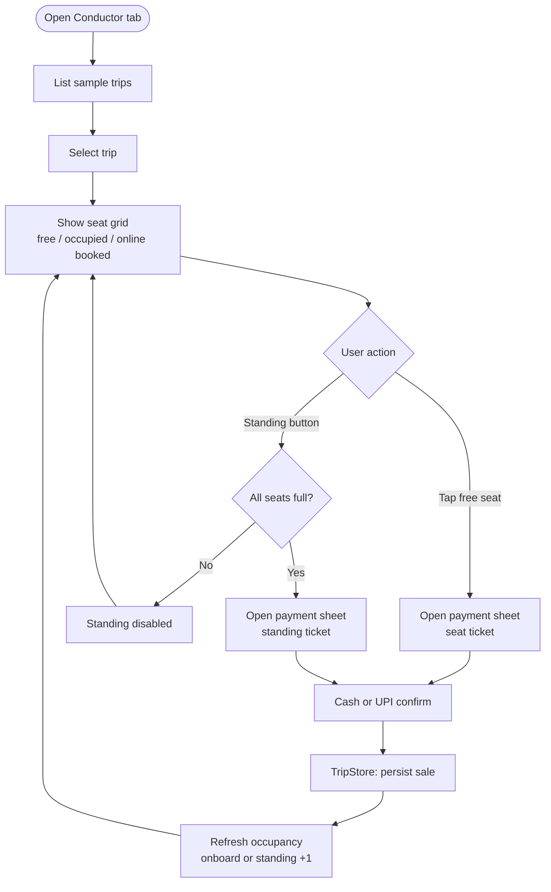
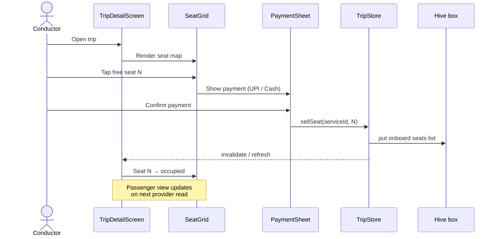
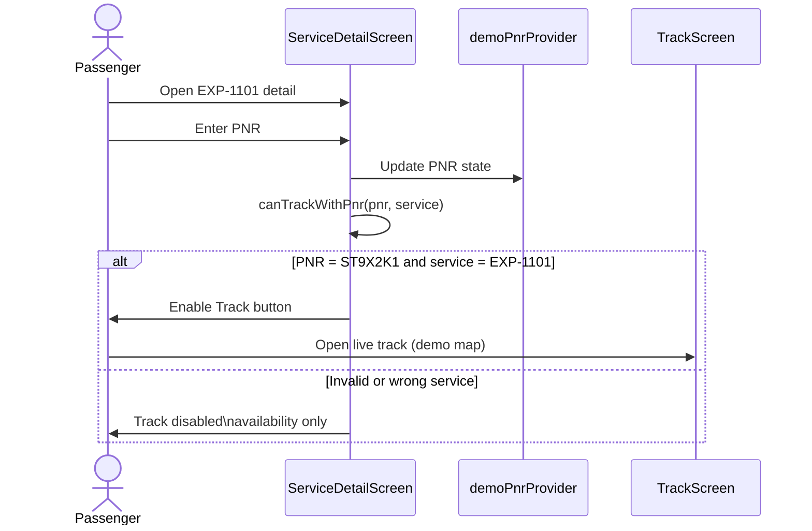
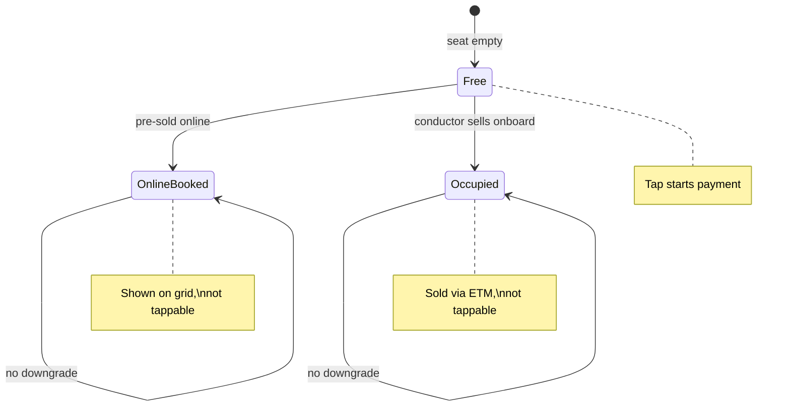

# UML diagrams

Seatly v0.1 — product and domain model views. Diagrams use [Mermaid](https://mermaid.js.org/) (renders on GitHub).

Related: [02-product-vision.md](02-product-vision.md) · [03-rules-and-flows.md](03-rules-and-flows.md)

Implementation reference: Flutter app on `main` / `code-file` branches.

---

## 1. Use case diagram

Actors and what they can do in v0.1.



**Notes**

- `Track bus live` extends `Enter PNR` — only when PNR is confirmed for that service (demo: `ST9X2K1` on `EXP-1101`).
- `Sell standing ticket` requires all seats occupied.

---

## 2. Domain class diagram

Core entities and how occupancy is derived.



**Occupancy rule (derived)**

```
occupied_seats = onlineBookedSeats ∪ onboardOccupiedSeats
seats_left = totalSeats - |occupied_seats|
standing_count = sold standing tickets (only when seats_left = 0)
```

---

## 3. App component diagram

Flutter layers on `main` / `code-file` (logical, not deployment).



---

## 4. Passenger activity diagram



---

## 5. Conductor activity diagram



---

## 6. Sequence diagram — sell seated ticket

Conductor taps a free seat through payment to updated occupancy.



---

## 7. Sequence diagram — passenger track gate

Track is conditional on confirmed PNR.



---

## 8. State diagram — seat on a trip



Standing passengers are **not** assigned a seat state; they increment `standingCount` on the `BusService` when all seats are in `OnlineBooked` or `Occupied`.

---

## Diagram index

| # | Diagram | Purpose |
|---|---------|---------|
| 1 | Use case | Who does what |
| 2 | Class | Domain entities & occupancy |
| 3 | Component | Flutter app layers |
| 4 | Passenger activity | Search → detail → track gate |
| 5 | Conductor activity | Seat map → pay → standing |
| 6 | Sequence (seat sale) | ETM ticket issuance |
| 7 | Sequence (track gate) | PNR unlocks map |
| 8 | State (seat) | free / occupied / onlineBooked |

To edit diagrams, change the Mermaid blocks in this file and preview on GitHub or any Mermaid-compatible viewer.
